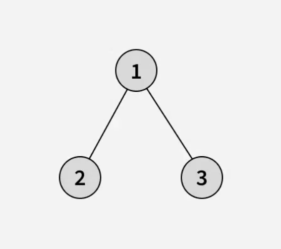
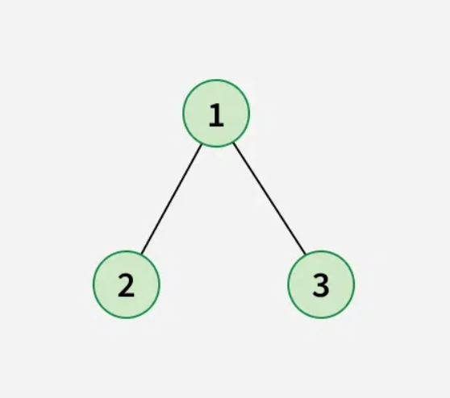
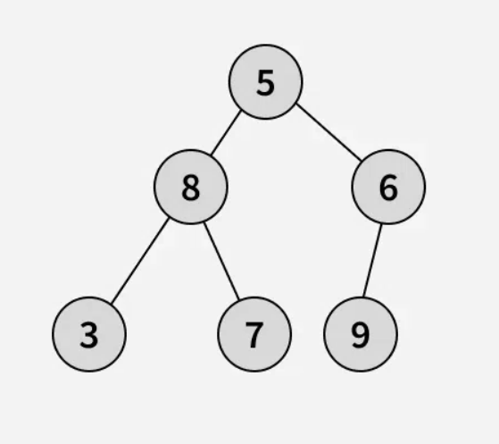
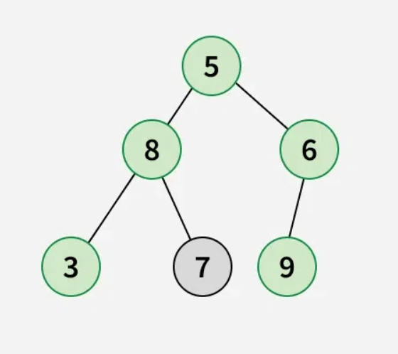

# 🌲 **Diameter of a Binary Tree**

## 📜 **Problem Statement**

Given a **binary tree**, the **diameter** (also called **width**) is the **number of edges** on the **longest path** between **two leaf nodes**.  
The path **may or may not pass through the root**. Your task is to **find the diameter of the tree**.

---

## 📌 **Constraints**

- **1 ≤ number of nodes ≤ 10⁵**
- **0 ≤ node->data ≤ 10⁵**

---

## 📥 **Input Format**

A **binary tree** represented as `root`.

- First, enter the number of nodes `n`.
- Next, enter `n-1` lines containing **three values**:
  - `parent` (parent node)
  - `child` (child node)
  - `L/R` (L for left child, R for right child)

---

## 📤 **Output Format**

Return an **integer**, representing the **diameter** of the tree.

---

## 📝 **Examples & Explanations**

### **Example 1**

#### 🔹 **Input**



#### ✅ **Output**

```plaintext
2
```

#### 🧐 **Explanation**



- **Longest Path:** `2 → 1 → 3`
- **Edges Count:** `2`

---

### **Example 2**

#### 🔹 **Input**



#### ✅ **Output**

```plaintext
4
```

#### 🧐 **Explanation**



- **Longest Path:** `3 → 8 → 5 → 6 → 9`
- **Edges Count:** `4`

---

## 🚀 **Approach**

### 🔹 **1. Brute Force Approach**

#### 🔍 **Idea:**

- Compute **height for every node**.
- **For each node**, find the **sum of left and right subtree heights**.
- Track the **maximum sum**.

⏳ **Time Complexity:** `O(n²)` (Height calculation takes `O(n)`, and we call it for every node)  
🛠️ **Space Complexity:** `O(h)` (Recursive stack size, where `h` is the height)

#### ❌ **Why Brute Force Fails?**

- **Redundant height calculations**.
- **Inefficient for deep trees**.

---

### 🔹 **2. Optimized Approach (DFS with Height Calculation)**

✅ **Use Depth-First Search (DFS) to compute height & diameter in one pass**  
✅ **At each node, compute**:

- **Left subtree height**
- **Right subtree height**
- **Update diameter** as `left_height + right_height`

⏳ **Time Complexity:** **O(n)** (Each node is visited once)  
🛠️ **Space Complexity:** **O(h)** (Recursive call stack for tree height `h`)

---

## ✅ **Optimized Recursive DFS Solution (Java)**

```java
import java.util.*;

// Node class representing a binary tree node
class Node {
    int data;
    Node left, right;

    Node(int item) {
        data = item;
        left = right = null;
    }
}

// Class representing the Binary Tree
class BinaryTree {
    Node root;

    // Class to store diameter
    static class TreeInfo {
        int height;
        int diameter;

        TreeInfo(int h, int d) {
            height = h;
            diameter = d;
        }
    }

    // Function to find diameter using DFS
    static TreeInfo diameterUtil(Node node) {
        if (node == null) {
            return new TreeInfo(-1, 0);  // height = -1, diameter = 0
        }

        TreeInfo left = diameterUtil(node.left);
        TreeInfo right = diameterUtil(node.right);

        int height = Math.max(left.height, right.height) + 1;
        int currDiameter = left.height + right.height + 2;
        int maxDiameter = Math.max(currDiameter, Math.max(left.diameter, right.diameter));

        return new TreeInfo(height, maxDiameter);
    }

    // Main function to return diameter
    int diameter(Node root) {
        return diameterUtil(root).diameter;
    }
}
```

---

## 🎯 **Example Walkthrough**

Let's take the input:

```
6
5 8 L
5 6 R
8 3 L
8 7 R
6 9 R
```

🟢 **Tree Representation**:

```
        5
       / \
      8   6
     / \    \
    3   7    9
```

### **Step-by-Step Execution**

| Node | Left Height | Right Height | Computed Diameter |
| ---- | ----------- | ------------ | ----------------- |
| 3    | -1          | -1           | `0`               |
| 7    | -1          | -1           | `0`               |
| 8    | `0`         | `0`          | `2`               |
| 9    | -1          | -1           | `0`               |
| 6    | -1          | `0`          | `1`               |
| 5    | `2`         | `1`          | **`4`**           |

### ✅ **Final Output**

```plaintext
4
```

---

## 🕒 **Time & Space Complexity**

| Complexity                     | Value                                               |
| ------------------------------ | --------------------------------------------------- |
| **Worst Case Time Complexity** | **O(n)** (Each node is processed once)              |
| **Best Case Complexity**       | **O(n)**                                            |
| **Space Complexity**           | **O(h)** (Recursive call stack for tree height `h`) |

---

## 🎉 **Key Takeaways**

✅ **DFS Recursion** efficiently calculates **diameter** with **O(n) time complexity**.  
✅ **Only one recursive function call per node**, making it optimal.  
✅ **Handles deep trees efficiently** (`n = 10⁵`).

🔹 **Try running the program with different test cases! 🚀**
