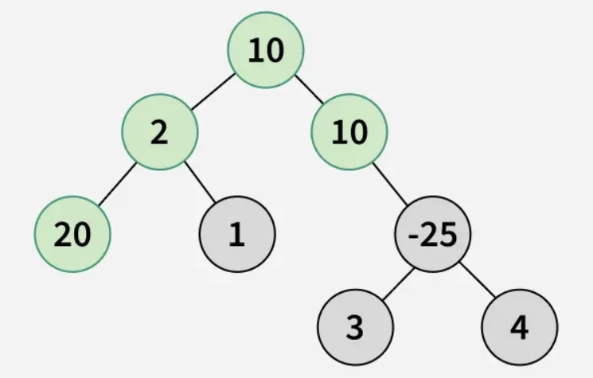
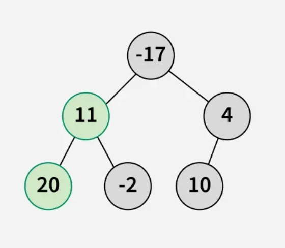

## 🌟 Maximum Path Sum from Any Node in a Binary Tree 🌲

## 📜 **Problem Statement**

Given a **binary tree**, the task is to **find the maximum path sum** in the tree. The **path may start and end at any node**, meaning the sum is **not necessarily from root to leaf**.

🔹 **Allowed paths**:

- Any node to any other node in the tree
- Paths may pass through **one or more intermediate nodes**
- The sum can be **negative**, as nodes may contain negative values

---

## 📌 **Constraints**

🔹 `1 ≤ number of nodes ≤ 10³`  
🔹 `-10⁴ ≤ node->data ≤ 10⁴`

---

## ⚙️ **Function Description**

```java
class Solution {
    // Function to return the maximum path sum from any node in the tree.
    int findMaxSum(Node node) {
    }
}
```

**Parameters**:

- `Node node` → The root node of the binary tree

**Returns**:

- The **maximum path sum** that can be obtained from any node to any other node

---

## 📥 **Input Format**

- The first line contains an integer `n`, the **number of nodes** in the tree.
- The next `n-1` lines contain **three values**: `parent child L/R`, representing the relationship between nodes in the tree.

---

## 📤 **Output Format**

- A **single integer** representing the maximum path sum

---

## 🔍 **Examples with Explanation**

### **Example 1**

**Input:**

```
root[] = [10, 2, 10, 20, 1, N, -25, N, N, N, N, 3, 4]
```

**Tree Structure:**

```
       10
      /  \
     2   10
    / \     \
   20  1    -25
           /    \
          3      4
```

**Output:**

```
42
```

**Explanation:**  


The **maximum path sum** is obtained from the path **20 → 2 → 10 → 10**, which gives `20 + 2 + 10 + 10 = 42`.

---

### **Example 2**

**Input:**

```
root[] = [-17, 11, 4, 20, -2, 10]
```

**Tree Structure:**

```
       -17
      /    \
    11      4
   /  \    /
 20   -2  10
```

**Output:**

```
31
```

**Explanation:**



The **maximum path sum** is from `20 → 11 → -17 → 4 → 10`, which sums to `31`.

---

## 🛠 **Approach**

### **1️⃣ Brute Force Approach (Inefficient) ❌**

- **Try all possible paths** using DFS and compute sums
- **Fallbacks:** High **time complexity** `O(n²)` due to redundant calculations

---

### **2️⃣ Optimized Approach (Using DFS) ✅**

💡 **Intuition**:

- Use **Depth-First Search (DFS)** to explore each node
- Maintain a **global variable** to store the maximum path sum
- For each node:
  - Compute **maximum left** and **maximum right** subtree sums
  - Update the **global max sum** with the sum of **left + right + current node**
  - Return **max path sum** from the current node to be used in its parent’s computation

🔹 **Time Complexity**: `O(n)`, since each node is visited once  
🔹 **Space Complexity**: `O(h)`, where `h` is the **height of the tree** (`O(log n)` for balanced, `O(n)` for skewed)

---

## 🔥 **Efficient Code Implementation**

```java
import java.util.*;

class Node {
    int data;
    Node left, right;

    Node(int d) {
        data = d;
        left = right = null;
    }
}

class Solution {
    int maxSum;

    // Function to return the maximum path sum from any node in a tree.
    int findMaxSum(Node root) {
        maxSum = Integer.MIN_VALUE;
        dfs(root);
        return maxSum;
    }

    // Helper function using DFS to compute maximum path sum
    private int dfs(Node node) {
        if (node == null) return 0;

        // Compute left and right max path sums (ignore negatives)
        int leftMax = Math.max(0, dfs(node.left));
        int rightMax = Math.max(0, dfs(node.right));

        // Update global max sum considering this node as the root of max path
        maxSum = Math.max(maxSum, leftMax + rightMax + node.data);

        // Return max path sum including this node
        return node.data + Math.max(leftMax, rightMax);
    }
}
```

---

## 🏆 **Example Walkthrough**

🔹 **User Input**:

```
Enter number of nodes:
7
Enter nodes (parent child L/R):
10 2 L
10 10 R
2 20 L
2 1 R
10 -25 R
-25 3 L
-25 4 R
```

🔹 **Output:**

```
Maximum Path Sum: 42
```

---

## 🎯 **Why This Approach?**

✅ **Efficient**: Uses **DFS** (`O(n)`) instead of brute force (`O(n²)`).  
✅ **Optimized Memory**: Uses **O(h) space** (stack calls for recursion).  
✅ **Handles Negative Values**: Ignores paths contributing negatively.

---

## 🎉 **Final Thoughts**

This **optimized approach** efficiently finds the **maximum path sum** using **DFS**, making it **fast and scalable**! 🚀🔥

💡 **Do you need any modifications or explanations? Let me know!** 😊
